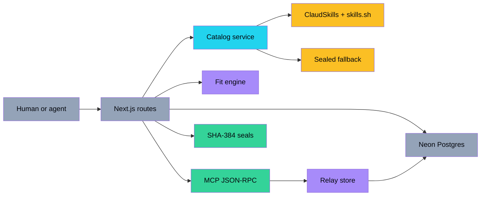
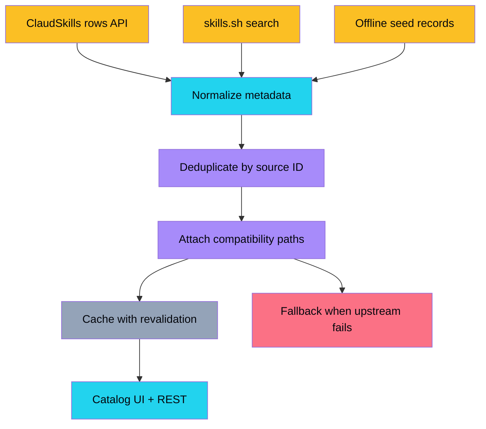
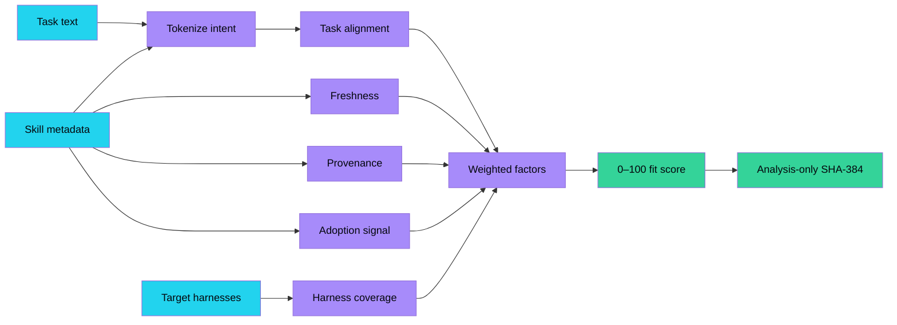
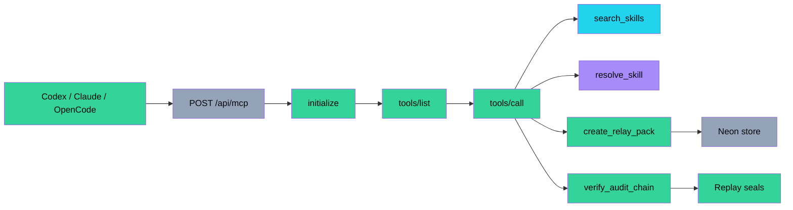
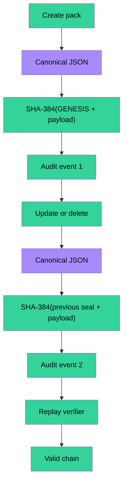
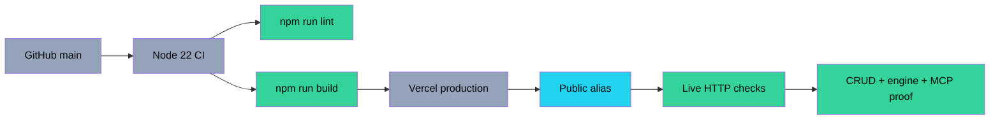
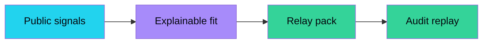
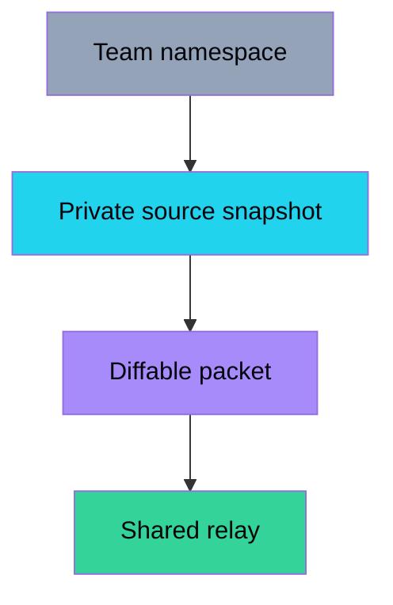
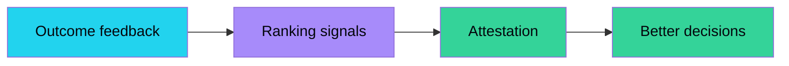

<div align="center">

# Skill Relay

### Route one public agent skill to every runtime.

[](https://skill-relay-tau.vercel.app)
[](LICENSE)
[](https://nextjs.org)
[](https://neon.tech)
[](#-data-boundary)
[](#-agent-interface)

[Live App](https://skill-relay-tau.vercel.app) · [API](https://skill-relay-tau.vercel.app/api/openapi.json) · [MCP](https://skill-relay-tau.vercel.app/api/mcp) · [Issues](https://github.com/aniruddhaadak80/skill-relay/issues)

</div>

---

## ✨ Features

- **179,054+ public skill records** surfaced through the ClaudSkills mirror, with live `skills.sh` search and a sealed offline fallback.
- **Cross-harness relay paths** for Claude Code, Codex, OpenClaw, Hermes Agent, OpenCode, Gemini CLI, and Cursor.
- **Copy-first skill bundles** with one-click SKILL.md, JSON, source URL, and agent-payload actions, complete with clipboard fallback and visible copied/error states.
- **Explainable fit engine** with task alignment, freshness, provenance, adoption, harness coverage, and review-surface factors.
- **Persistent relay packs** in Neon Postgres with real create, read, update, delete, export, and seed behavior.
- **MCP-style JSON-RPC** with `initialize`, `tools/list`, search, scoring, audit verification, and mutating pack tools.
- **Replayable SHA-384 mutation chain** that distinguishes analysis-only seals from persisted audit seals.
- **Next.js App Router + TypeScript + Tailwind + Framer Motion + Lucide** with responsive paper/ink visual identity.
- **No core API keys required**; source failures degrade to labeled offline records instead of a broken first paint.

> Skill Relay resolves public metadata and native paths. It does not certify that a third-party skill is safe to execute. Read the upstream source before installing instructions or scripts.

## The 10-second wow moment

Open **Explore**, search `debugging`, select a real public record, drag the fit threshold, choose every target harness, and press **Create relay pack**. The app returns a persisted record with a native install matrix. Open **Agent console** and the same action is available as `create_relay_pack` over JSON-RPC.

## Jobs-to-be-done

1. **A developer can search and rank a public skill for a concrete task so they can choose a useful capability without reading ten repositories.**
2. **A team can save, edit, export, and delete a cross-harness relay pack so a workflow survives handoffs between agents and people.**
3. **An agent can discover, score, create, and verify a relay through the same API so automation does not need a private integration.**

## Identity

**Paper index + kinetic signal rails** because the concept is translation and provenance, not surveillance or spectacle; delta vs `skillforge` and `upgrade-atelier`: a light editorial compatibility workbench with animated relay topology instead of a dark catalog or paper dossier.

## System architecture



## Data pipeline

Every source is normalized into `src/lib/types.ts`; no UI component invents a skill record.



### Data boundary

The headline count is a public dataset observation, not synthetic filler. The catalog reads the [ClaudSkills Hugging Face mirror](https://huggingface.co/datasets/claudskills/skills) and uses the public [skills.sh](https://skills.sh) search endpoint for live ranking. If both are unavailable, the API returns a small, explicitly labeled sealed fallback so the app remains explorable. User-created packs never use that fallback as a substitute for Neon persistence.

## Fit engine

The same `scoreSkill` function serves the UI, REST, and MCP surfaces.



| Factor | Weight | What it proves |
| --- | ---: | --- |
| Task alignment | 35 | Metadata vocabulary overlaps the requested task. |
| Freshness | 15 | The source snapshot has a usable recent date. |
| Provenance | 15 | Source URL, author, and license are present. |
| Adoption signal | 15 | The public source reports install activity. |
| Harness coverage | 20 | Every selected target has a concrete native path. |
| Review surface | 10 | Sensitive capability words lower confidence. |

## Agent interface

The endpoint accepts JSON-RPC 2.0 and exposes a mutating `create_relay_pack` tool plus `update_relay_pack`.



## Integrity model

Two hashes are intentionally separated: an analysis seal explains a score; an audit seal proves mutation order.



## User journey

```mermaid
flowchart LR
  FIND["Search a task"]:::data --> FILTER["Filter source, category, harness, fit"]:::data
  FILTER --> INSPECT["Inspect factors + source"]:::engine
  INSPECT --> PACK["Create relay pack"]:::agent
  PACK --> EDIT["Edit or export"]:::agent
  EDIT --> VERIFY["Verify audit chain"]:::verified
  VERIFY --> INSTALL["Review native install path"]:::external
  classDef data fill:#22d3ee,color:#04060c
  classDef engine fill:#a78bfa,color:#04060c
  classDef agent fill:#34d399,color:#04060c
  classDef verified fill:#34d399,color:#04060c
  classDef external fill:#fbbf24,color:#04060c
```



## Deployment pipeline



## 🗺️ Roadmap

### Now · make the relay useful

- [x] Search the public index and filter by task, source, harness, and fit.
- [x] Explain a score with itemized factors and native compatibility paths.
- [x] Persist relay packs in Neon and expose CRUD through REST.
- [x] Expose mutating MCP tools and a replayable SHA-384 audit chain.



### Next · make the relay collaborative

- [ ] Add signed team namespaces so a pack can be shared without mixing workspaces.
- [ ] Add source snapshots with commit-aware freshness and diffable skill content.
- [ ] Add a CLI that imports the same `/api/catalog` and `/api/mcp` contracts.



### Later · make the relay measurable

- [ ] Add outcome feedback so successful workflows improve ranking signals.
- [ ] Add signed provenance attestations and optional security audit providers.
- [ ] Add a visual diff between two harness-native packet formats.



## 🚀 Quickstart

```bash
git clone https://github.com/aniruddhaadak80/skill-relay.git
cd skill-relay
npm install
cp .env.example .env.local
npm run dev
```

The core experience works with zero environment variables locally. To use hosted persistence, copy the Neon `DATABASE_URL` into `.env.local`; the app creates its two small tables on first use.

```bash
npm run lint
npm run build
npm run start
```

### Production environment

| Variable | Required | Purpose |
| --- | --- | --- |
| `DATABASE_URL` | Production | Neon pooled Postgres connection for relay packs and audit events. |
| `NEXT_PUBLIC_SITE_URL` | Optional | Canonical sitemap/robots base URL. |
| `VERCEL_OIDC_TOKEN` | Not required | Optional upstream skills.sh authenticated access; the public search endpoint is used by default. |

Never commit `.env.local`, Neon credentials, or Vercel tokens.

## 🔌 API

Base URL: `https://skill-relay-tau.vercel.app`

### Health

```bash
curl https://skill-relay-tau.vercel.app/api/health
```

### Search the public index

```bash
curl "https://skill-relay-tau.vercel.app/api/catalog?q=debugging&limit=10"
```

### Score a skill

```bash
curl -X POST https://skill-relay-tau.vercel.app/api/engine \
  -H "content-type: application/json" \
  -d '{"task":"review a pull request safely","skillId":"code-review","harnesses":["Codex","Claude Code"]}'
```

The response includes `score`, `recommendation`, `factors`, `compatibility`, and an `analysis-only` SHA-384 `seal`.

### Copy a skill for a human or agent

```bash
curl https://skill-relay-tau.vercel.app/api/skills/frontend-design
curl https://skill-relay-tau.vercel.app/api/skills/frontend-design/markdown
```

The JSON response includes the exact `copy` bundle. The Markdown endpoint returns a metadata-only `SKILL.md` manifest with source, license, profile, JSON, and install-path references. The UI exposes the same values as **Copy SKILL.md**, **Copy JSON**, **Copy source URL**, and **Copy agent payload**.

### Mutation proof: create → read back

```bash
curl -X POST https://skill-relay-tau.vercel.app/api/packs \
  -H "content-type: application/json" \
  -d '{"name":"My review relay","task":"Review a pull request safely","selectedSkillId":"mattpocock/skills/code-review","selectedSkillName":"code-review","harnesses":["Codex","Claude Code","OpenCode"]}'

curl https://skill-relay-tau.vercel.app/api/packs/<returned-id>
```

Update and delete use `PATCH` and `DELETE` on `/api/packs/<id>`. Every mutation appends an audit event; `GET /api/audit` replays the chain.

### OpenAPI

- [`/api/openapi.json`](https://skill-relay-tau.vercel.app/api/openapi.json)
- [`/api/feed`](https://skill-relay-tau.vercel.app/api/feed) — cached public feed
- [`/api/skills/<slug>/markdown`](https://skill-relay-tau.vercel.app/api/skills/frontend-design/markdown) — metadata-only Markdown copy bundle

## Agent setup

The repository ships [`public/mcp.json`](public/mcp.json) for MCP-compatible clients. The in-page console is the fastest proof:

1. Open `/agent`.
2. Press **Inspect tools/list JSON**.
3. Run **Search catalog**, **Score fit**, or **Create proof pack**.
4. Open the returned pack URL and verify the audit chain.

Example client configuration:

```json
{
  "mcpServers": {
    "skill-relay": {
      "command": "npx",
      "args": ["-y", "mcp-remote", "https://skill-relay-tau.vercel.app/api/mcp"]
    }
  }
}
```

MCP tools:

| Tool | Mutating | Purpose |
| --- | --- | --- |
| `search_skills` | No | Search normalized public skill signals. |
| `resolve_skill` | No | Return a ranked skill and explainable fit. |
| `get_skill` | No | Return one exact skill plus JSON, Markdown, source, and agent-payload URLs. |
| `get_skill_markdown` | No | Return the safe metadata-only SKILL.md manifest for one exact skill. |
| `create_relay_pack` | Yes | Persist a new cross-harness pack. |
| `update_relay_pack` | Yes | Update a pack and append an audit event. |
| `list_relay_packs` | No | Read persisted workspace state. |
| `verify_audit_chain` | No | Replay the mutation chain. |
| `get_health` | No | Read persistence and source health. |

## 📁 Project map

| Route | What it does |
| --- | --- |
| `/` | Editorial landing page, source pulse, feature map, featured packets. |
| `/explore` | Search, advanced filters, compatibility matrix, and relay builder. |
| `/skill/[id]` | Public source profile, score factors, install paths, and pack creation. |
| `/packs` | Persisted relay shelf with create, filter, refresh, and chain verification. |
| `/packs/[id]` | Edit, update, export, delete, install matrix, and audit seal detail. |
| `/agent` | Live MCP-style JSON-RPC console with mutating proof actions. |
| `/api/health` | Service and Neon persistence health. |
| `/api/catalog` | Normalized public catalog search/browse. |
| `/api/feed` | Cached public feed. |
| `/api/engine` | Deterministic score and analysis seal. |
| `/api/packs` | `GET` list and `POST` create relay packs. |
| `/api/packs/[id]` | `GET`, `PATCH`, and `DELETE` one pack. |
| `/api/audit` | Audit events plus chain verification result. |
| `/api/skills/[id]` | Exact public skill JSON plus canonical human/agent copy bundle. |
| `/api/skills/[id]/markdown` | Metadata-only Markdown copy bundle. |
| `/api/mcp` | JSON-RPC `initialize`, `tools/list`, and `tools/call`. |
| `/api/openapi.json` | Machine-readable REST contract. |
| `public/mcp.json` | Client-ready MCP configuration. |

Key implementation files:

- `src/lib/types.ts` — normalized catalog, harness, pack, and MCP types.
- `src/lib/catalog.ts` — upstream normalization, caching, and sealed fallback.
- `src/lib/skill-copy.ts` — canonical Markdown, JSON, source, and agent-payload serialization.
- `src/lib/engine.ts` — deterministic score, compatibility paths, and analysis seal.
- `src/lib/store.ts` — Neon schema, CRUD, seed behavior, and audit replay.
- `src/components/copy-button.tsx` — accessible Clipboard API/fallback controls and Copy Rail.
- `src/app/api/mcp/route.ts` — agent tool boundary.
- `src/app/globals.css` — paper/ink identity, texture, motion, and responsive system.

## Safety and provenance

Skill Relay is adjacent to code execution because agent skills can contain instructions, scripts, and references. The app deliberately does not execute upstream skill content. It displays source URLs, labels live versus fallback data, exposes a review surface, and keeps audit hashes separate from safety claims. Use the upstream repository, `agentskills.io`, and your own review process before installing a third-party skill.

## 🤝 Contributing

Read [CONTRIBUTING.md](CONTRIBUTING.md), keep changes focused, and include a reproducible proof for any engine or persistence change. Please do not add synthetic catalog records to make a count look larger.

## License

MIT. See [LICENSE](LICENSE).

## Feed attribution

- [ClaudSkills dataset](https://huggingface.co/datasets/claudskills/skills) — public daily mirror used for record metadata and the 179,054-row catalog observation.
- [skills.sh](https://skills.sh) — public search and install-signal source.
- [Agent Skills format](https://agentskills.io) — open format context and client compatibility.
- [Neon](https://neon.tech) — hosted Postgres persistence.

The catalog is a discovery and translation layer. It does not relicense or redistribute third-party skill instructions.
